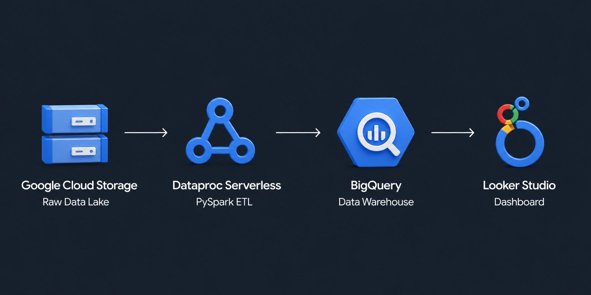
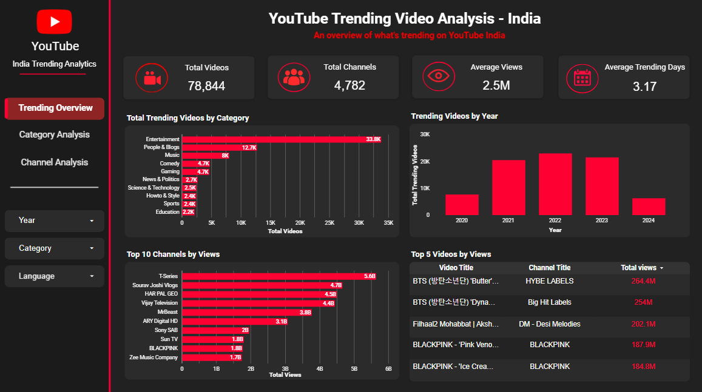
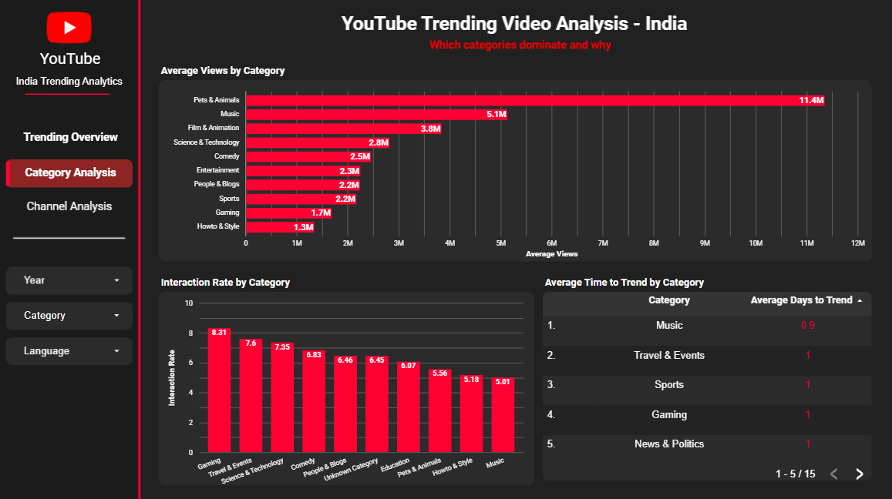
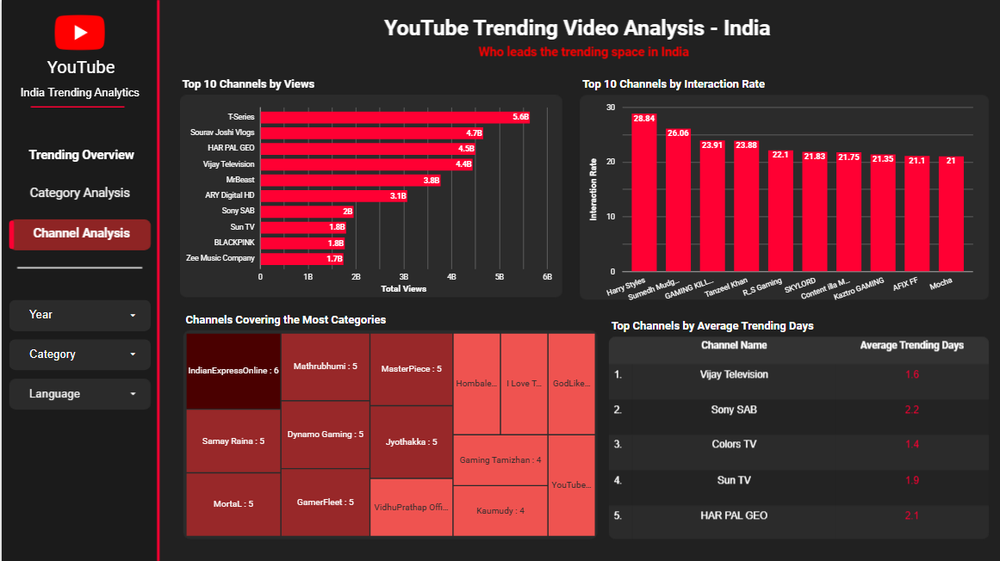

# YouTube Trending Video Analytics for India

An end-to-end data analytics project analyzing four years of YouTube India trending data — powered by a cloud pipeline on GCP, delivering insights on content trends, channel performance, and audience engagement.

---

## Project Overview

YouTube's trending page is one of the strongest signals for content creators, media
companies, and digital marketers in India. Understanding which categories, channels,
and content types consistently trend and why — gives a real edge in content strategy.

This project takes four years of YouTube India trending data (2020–2024), cleans and
transforms it through a cloud pipeline, and delivers those insights through an
interactive dashboard that stakeholders can filter and explore.

---

## Dataset

- **Source:** [Kaggle — YouTube Trending Video Dataset](https://www.kaggle.com/datasets/rsrishav/youtube-trending-video-dataset)
  (Multi-country dataset — India-specific files used: `INvideos.csv` + `IN_category_id.json`)
- **Raw size:** ~401MB, ~251,000 rows
- **Period:** July 2020 – April 2024
- **Structure:** One row per video per trending day with cumulative engagement metrics

---

## Pipeline Walkthrough

### Step 1 — Upload Raw Data to GCS
Raw CSV and JSON files uploaded to GCS as the data lake. No transformations
at this stage — raw data preserved as-is.

### Step 2 — PySpark ETL on Dataproc Serverless

The raw dataset had one row per video per trending day with cumulative
engagement metrics — each row's view count, likes, dislikes, and comments
included all previous days' totals. Aggregating across these rows directly
would count the same video's engagement multiple times, producing inflated
and misleading results.

To fix this, all rows for each video were consolidated into a single row
using `video_id` as the unique key. Engagement metrics are taken from the
last row (the final cumulative total). Two new columns were derived:

- `days_to_trend` — days between publish date and first trending date
- `days_trending` — total days the video stayed on the trending page

The ETL also handles standard cleaning: column drops, data type fixes,
deduplication, null removal, whitespace stripping, column renaming, and
keyword-based language detection across 11 Indian languages.

Full script: `dataproc/youtube_etl.py`

### Step 3 — Load into BigQuery
Transformed data loaded into BigQuery as a single unified table —
**78,844 rows, one per unique video** — ready for SQL analysis and dashboard reporting.

### Step 4 — SQL Analysis
22 queries across 5 sections covering category performance, channel rankings,
video highlights, language distribution, and publishing patterns.

Full query file: `sql/analysis_queries.sql`

### Step 5 — Looker Studio Dashboard
3-page interactive dashboard built directly on the BigQuery table.
Filters for Year, Category, and Language applied across all pages.

---

## Data Limitations

- **Dislikes:** 63.26% of dislike values are zero — YouTube removed public dislike
  counts globally on November 10, 2021. Dislike-based analysis is only reliable
  for videos trending before that date.
- **Language detection:** Keyword-based detection classifies 56.8% of videos as
  Unknown. Language analysis results should be interpreted with this in mind.
- **days_trending:** Calculated as `last_trending_date - first_trending_date + 1`,
  which assumes no gaps in a video's trending run.
- **Partial years:** 2020 and 2024 have lower video counts — the dataset starts
  in July 2020 and ends in April 2024.

---

## Key Findings

**Content Categories**
- Entertainment dominates volume with 33,796 trending videos — 2.6x more than
  People & Blogs (12,743), the next closest category
- Pets & Animals leads average views at 11.4M per video despite only 30 videos —
  niche but extremely high-reach content
- Gaming drives the highest interaction rate at 8.31 per 100 views, well ahead of
  the dataset average
- News & Politics has the lowest interaction rate (2.06) and the highest
  ratings-disabled percentage (8.3%)

**Channels**
- T-Series leads total views at 5.6B across its trending videos
- Vijay Television has the most trending videos at 2,072 — nearly 2x the next channel
- Harry Styles leads interaction rate at 28.84, driven by concentrated fan engagement
- IndianExpressOnline is the most category-diverse channel, with trending videos
  across 6 different categories

**Videos**
- BTS 'Butter' is the most-viewed trending video at 264.4M views
- Multiple videos reached 11 trending days — the maximum in the dataset
- Average time to reach trending: 1.06 days — most videos trend within 24 hours
- Music reaches trending fastest (0.91 days avg); Howto & Style takes the longest (1.24 days)

**Language**
- Hindi leads volume with 11,879 trending videos; Punjabi leads average views at 3.8M
- Music is the top-performing category for both Hindi and Punjabi audiences
- T-Series dominates Hindi trending content with 5.1B total views

**Publishing Patterns**
- Friday and Wednesday see the most trending video publications
- Weekend publishes (Saturday, Sunday, Friday) drive higher interaction rates
- 2022 was the peak year with 22,957 trending videos

---

## Dashboard

📊 **[View Dashboard](https://lookerstudio.google.com/your-dashboard-link-here)**

**Page 1 — Trending Overview**



**Page 2 — Category Analysis**



**Page 3 — Channel Analysis**



---

## Repository Structure

```
youtube-trending-analytics-for-india/
│
├── README.md
├── architecture/
│   └── pipeline_diagram.png
├── data/
│   ├── sample_INvideos.csv
│   ├── IN_category_id.json
│   └── cleaned_india_youtube_trending_data.csv
├── dataproc/
│   └── etl_transform.py
├── sql/
│   └── analysis_queries.sql
├── gcp_screenshots/
│   ├── gcs_bucket.png
│   ├── dataproc_batch.png
│   └── bigquery_table.png
├── dashboard/
│   └── screenshots/
│       ├── page1_trending_overview.png
│       ├── page2_category_analysis.png
│       └── page3_channel_analysis.png
└── notebook/
    └── eda.ipynb
```

---

## Tools and Technologies

| Tool | Role |
|---|---|
| Google Cloud Storage | Raw data lake |
| Dataproc Serverless | PySpark ETL — cleaning and transformation |
| Apache PySpark | Distributed data processing |
| BigQuery | Cloud data warehouse and SQL analysis |
| Looker Studio | Interactive BI dashboard |
| Python | EDA, data profiling, cleaning notebook |
| Pandas | Data manipulation in EDA notebook |
| SQL | Analytical queries in BigQuery |

---

*Author: Deepak M*